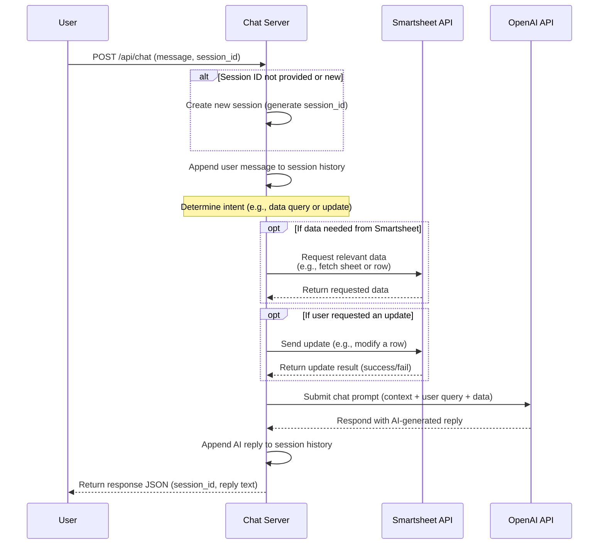

# Smartsheet-Integrated Chat Interface Code Analysis

## Code Overview

The codebase is organized into distinct components reflecting a typical web service architecture. It includes modules for the web server (API endpoints), Smartsheet API integration, OpenAI API integration, and session management. The **structure** is likely separated by functionality:

- **Web Server / Controller:** The entry point (e.g. a Flask app or Express server) defines HTTP routes for chat interactions. It receives user messages and orchestrates calls to other modules.
- **Smartsheet Integration Module:** Handles all communication with the Smartsheet API. This module is responsible for retrieving data from sheets (e.g. reading rows/columns) and updating sheet content via API calls. It uses a Smartsheet API token for authentication to authorize requests ([GitHub - smartsheet/smartsheet-javascript-sdk: Library that uses Node.js and JavaScript to connect to Smartsheet services.](https://github.com/smartsheet/smartsheet-javascript-sdk#:~:text=To%20call%20the%20API%20you,API%20Access)). For example, the code initializes a Smartsheet client with an access token ([GitHub - smartsheet/smartsheet-javascript-sdk: Library that uses Node.js and JavaScript to connect to Smartsheet services.](https://github.com/smartsheet/smartsheet-javascript-sdk#:~:text=%2F%2F%20Initialize%20the%20client%20var,API%20token%20logLevel%3A%20%27info%27)) and can call methods to list or get sheets ([GitHub - smartsheet/smartsheet-javascript-sdk: Library that uses Node.js and JavaScript to connect to Smartsheet services.](https://github.com/smartsheet/smartsheet-javascript-sdk#:~:text=%2F%2F%20List%20all%20sheets%20smartsheet,Choose%20the%20first%20sheet)).
- **OpenAI Integration Module:** Encapsulates calls to OpenAI's API (likely using the OpenAI Python/Node SDK). This module prepares prompt messages and sends them to OpenAI’s Chat Completion endpoint. It might include functions to format conversation history into the required `messages` list and invoke `openai.ChatCompletion.create` ([basic openai chat completion example · GitHub](https://gist.github.com/pszemraj/c643cfe422d3769fd13b97729cf517c5#:~:text=messages%20%3D%20%5B%20%7B,prompt%7D%2C)). The OpenAI API key is used here (usually loaded from configuration).
- **Session Management:** Manages chat sessions or conversation state. This could be an in-memory store or database that tracks each user’s session ID and message history. It ensures that consecutive messages from the same user are handled in context. Key responsibilities include creating new sessions, storing past messages, and retrieving context for ongoing sessions.
- **Utility/Config:** (Optional) A configuration file or constants for things like Smartsheet sheet IDs, column mappings, or API keys. This keeps sensitive tokens out of the main code and uses environment variables or config files to load them, improving security and flexibility.

Each module has a clear responsibility: the web server routes input to the appropriate handlers, the Smartsheet module abstracts sheet operations, the OpenAI module handles AI responses, and session management ties it all together. This separation of concerns makes the code easier to maintain and extend.

## Detailed Breakdown

### API Request Handling

When a user sends a message via the chat interface, the request is received by a designated API endpoint (for example, a `POST /chat` route). The server-side code (controller) handling this endpoint will:

1. **Parse the Request:** Extract the user’s message and any session identifier from the HTTP request (usually JSON payload). For instance, it might expect a JSON like `{"session_id": "...", "message": "Hello"}`.
2. **Initialize/Lookup Session:** Using session management logic, the code determines if the `session_id` is new or existing. New sessions might trigger creation of a session record (assigning a new `session_id` and initializing conversation history), while existing sessions will retrieve the stored context (past messages).
3. **Process the Message:** The controller then delegates to a message processing function, which contains the core logic. This function checks the content of the message to decide how to handle it:
   - It may interpret certain commands or keywords. For example, if the user’s message includes a request to **retrieve data** (e.g., "What is the status of Project X?"), the code recognizes that it needs to query Smartsheet.
   - If the message implies an **update action** (e.g., "Mark Project X as completed"), the code identifies the operation and the target data.
4. **Data Retrieval from Smartsheet:** For queries requiring data, the code calls the Smartsheet integration module. This could involve calling a method like `get_sheet(sheet_id)` or a more specific query function. Under the hood, this uses Smartsheet’s REST API (via SDK or direct HTTP). For example, it might fetch a sheet by ID and filter for the row pertaining to "Project X". The Smartsheet API requires including the API token in the request header for authorization ([GitHub - smartsheet/smartsheet-javascript-sdk: Library that uses Node.js and JavaScript to connect to Smartsheet services.](https://github.com/smartsheet/smartsheet-javascript-sdk#:~:text=To%20call%20the%20API%20you,API%20Access)). The retrieved data (e.g., the status of "Project X") is returned to the controller.
5. **Updating Smartsheet (if needed):** If the user’s request is to update data, the code will prepare an API call to update the sheet. This typically involves sending a PUT request to Smartsheet’s API with the specific row ID and new values. The integration module would format the data as required by Smartsheet (for instance, constructing a JSON body with cell IDs and the new value) and call the appropriate endpoint. Upon success, Smartsheet returns a confirmation or the updated row data.
6. **OpenAI Response Generation:** Next, the processed information (including user query and any data from Smartsheet) is passed to the OpenAI integration module. This module builds the prompt for the AI:
   - It will include the user’s question. If data was retrieved from Smartsheet, that data can be embedded into the prompt or provided as part of the conversation context (for example, “The status of Project X is In Progress.” as a system or assistant message before the user's question).
   - It may also include a system message to set the assistant’s behavior (e.g., “You are a helpful assistant with access to project status data.”). Using a system message helps the model understand how to use the provided data and how to respond ([Work with the GPT-35-Turbo and GPT-4 models - Azure OpenAI Service | Microsoft Learn](https://learn.microsoft.com/en-us/azure/ai-services/openai/how-to/chatgpt#:~:text=OpenAI%20trained%20the%20GPT,list%20of%20dictionaries%20is%20used)).
   - The OpenAI SDK is then called. For instance, in Python, it would use `openai.ChatCompletion.create()` with a model (like GPT-3.5-Turbo or GPT-4) and a list of message dictionaries ([basic openai chat completion example · GitHub](https://gist.github.com/pszemraj/c643cfe422d3769fd13b97729cf517c5#:~:text=messages%20%3D%20%5B%20%7B,prompt%7D%2C)). These message dictionaries represent the conversation: roles like `"user"` for the latest user question and `"assistant"` or `"system"` for any prior context or instructions. The API call returns a response containing the AI’s reply text.
7. **Return the Response:** The AI’s reply is extracted from the OpenAI API response. The controller packages this into an HTTP response (e.g., JSON `{"reply": "Project X is currently in progress."}`) and sends it back to the client. If a new session was created, the response might also include the new `session_id`. The session history is then updated — appending the user message and the AI response — so that future messages in the same session include this context.

Throughout this flow, **error handling** is crucial. The code likely has try/catch (or try/except) blocks around external API calls:

- If the Smartsheet API call fails (network issue or invalid request), the code should catch the error and return a user-friendly message or error status.
- If the OpenAI API fails or times out, the system might return a fallback message (“Sorry, I couldn’t process that.”) rather than crashing.

The framework (Flask, Express, etc.) will take care of low-level request/response handling, but the logic above ensures each API request from the chat UI is processed with the right sequence: check session, get/update Smartsheet as needed, then invoke OpenAI, then respond.

### Smartsheet Data Retrieval, Storage, and Update

The integration with Smartsheet is a core part of this application. Here’s how the code handles Smartsheet data:

- **Retrieving Data:** The code uses Smartsheet’s API to fetch information from sheets. Typically, the Smartsheet module will have functions to get a sheet or search within a sheet. For example, it might call `smartsheet_client.Sheets.get_sheet(SHEET_ID)` to retrieve the entire sheet or use a filter if available. The result is usually a JSON (or a Python object) that contains rows and cells. The code then locates the specific cells needed. If, say, the user asked for “status of Project X”, the code will search the sheet’s rows for "Project X" (maybe by project name column), then extract the status cell value. The retrieved data might be stored in a temporary structure (like a dictionary or an object) to be used in formulating the answer.
  - The code does not typically persist this data long-term (since it can always query the sheet when needed), but it may cache it within the session context for quick reuse within the same conversation turn.
  - Smartsheet’s API is called using an authentication token in the header (e.g., `Authorization: Bearer <token>`). The token is obtained from the Smartsheet account settings and is required for all requests ([GitHub - smartsheet/smartsheet-javascript-sdk: Library that uses Node.js and JavaScript to connect to Smartsheet services.](https://github.com/smartsheet/smartsheet-javascript-sdk#:~:text=To%20call%20the%20API%20you,API%20Access)).
  - **Example:** If using the Smartsheet Python SDK, the module might do:
    ```python
    smartsheet_client = smartsheet.Smartsheet(access_token)
    sheet = smartsheet_client.Sheets.get_sheet(SHEET_ID)
    # Find the specific row and cell
    for row in sheet.rows:
        ...  # locate the row matching Project X and get the status cell
    ```
    If using direct REST calls, it would use an HTTP GET to `https://api.smartsheet.com/2.0/sheets/{sheet_id}` and parse the JSON.
- **Storing Data:** The phrase "storing data" in this context likely refers to how the application keeps any relevant state. The Smartsheet data itself is not permanently stored in the app (the source of truth is the Smartsheet sheet). However, the app might **store references or small pieces of data**:
  - It might store the `sheet_id` and important `column_id` values in configuration so it knows where to read/write.
  - During a session, after retrieving some data, the app could store that piece of info in the session context or as part of the prompt (for example, caching "Project X status = In Progress" so it doesn’t have to fetch again if the user asks a follow-up).
  - If the design required logging chat history to Smartsheet, the app might insert each Q&A as a new row in a "Chat Log" sheet. (This would be an additional feature: after sending the response, call Smartsheet API to add a row containing the user question and AI answer for record-keeping.)
- **Updating Data:** When the user’s message indicates changing something in Smartsheet (e.g., updating a status or adding a comment), the app performs an update:
  - It first identifies the target row (similar to retrieval, find the row by a key like project name or an ID provided in the message).
  - It then constructs an update request. Using the SDK, it could create a `Row` object with the new cell value and call `update_rows(sheet_id, [row])`. If using raw API, it sends a PUT request to `https://api.smartsheet.com/2.0/sheets/{sheet_id}/rows` with a JSON body specifying the rowId and changes. For example, a JSON to update might include:
    ```json
    [
      {
        "id": 1234567890123456,
        "cells": [{ "columnId": 2345678901234567, "value": "Complete" }]
      }
    ]
    ```
    This would set the value of the specified column in that row to "Complete".
  - After the API call, Smartsheet returns the updated row or a success status. The code can then confirm the change. It might include a confirmation in the AI’s response (e.g., "I’ve updated Project X status to Complete").
  - If multiple fields need updating at once, the code can batch them in one request. Smartsheet supports bulk operations to update multiple cells or rows in one call ([4 Smartsheet API best practices | Smartsheet](https://www.smartsheet.com/content-center/best-practices/tips-tricks/api-best-practices?srsltid=AfmBOoojbJpFAJU-NKOGZA31XFZYgK8QDhZ2fRw5FUVsMyduq-X_8tNz#:~:text=For%20maximum%20efficiency%2C%20use%20bulk,using%20a%20single%20API%20request)), which is more efficient than one call per cell.
- **Error Handling & Verification:** The code should verify that the data operations succeeded. If a retrieval returns nothing (e.g., "Project X" not found in sheet), the code can handle that by informing the user the item wasn’t found. If an update fails (wrong permissions or invalid value), the code should catch the error and possibly let the user know the update couldn’t be done.

Overall, the Smartsheet integration module abstracts these details so the rest of the app can just say “get me this data” or “update this row” without worrying about HTTP specifics. It ensures all API calls include the required auth and conform to Smartsheet’s data format.

### OpenAI Integration Utilization

The OpenAI integration is used to generate conversational responses and possibly to interpret user intent. Key aspects of how the code uses OpenAI:

- **API Choice:** The code is likely using OpenAI’s Chat Completion API (with a model like `gpt-3.5-turbo` or `gpt-4`) because this is a chat-based interface. This allows the system to send a series of messages (including context) and get a continuation from the AI that sounds conversational.
- **Prompt Construction:** Before calling OpenAI, the module constructs the `messages` list that represents the conversation so far:
  - It often starts with a **system message** that sets the stage, for example: `{"role": "system", "content": "You are a helpful assistant that has access to a project tracker."}`. This isn’t strictly required but is recommended to guide the AI ([Work with the GPT-35-Turbo and GPT-4 models - Azure OpenAI Service | Microsoft Learn](https://learn.microsoft.com/en-us/azure/ai-services/openai/how-to/chatgpt#:~:text=OpenAI%20trained%20the%20GPT,list%20of%20dictionaries%20is%20used)).
  - Then it includes the conversation history: previous user and assistant messages, if any, in order. This provides context to the model about what has been discussed.
  - Finally, the latest user query is added as a `{"role": "user", "content": "…user's question..."}` message.
- **API Call:** The OpenAI Python/Node SDK is used to call the API with the constructed message list. For example, in Python:
  ```python
  response = openai.ChatCompletion.create(
      model="gpt-3.5-turbo",
      messages=messages,
      temperature=0.7
  )
  ```
  This sends the request to OpenAI’s servers. The code includes the API key (set either globally or passed in the call) to authenticate.
- **Response Handling:** The OpenAI API will return a response object containing one or more choices. The code picks the first choice (`response.choices[0].message["content"]` in Python) which is the AI’s reply text. This text is then used as the chatbot’s answer to the user.
- **Use of OpenAI for Logic:** In some implementations, OpenAI might also be used to parse commands or decide actions. For instance, the developers might prompt the model with something like “Determine if the user is asking for data or an update. Answer with JSON: `{"action": ..., "item": ...}`” – effectively using the AI to interpret the user message into a structured form (this is a form of **natural language understanding via AI**). However, given this is a straightforward integration, it’s more likely the code itself (through simple if/else or regex) handles intent, and OpenAI is primarily used for generating the response text in a friendly manner.
- **Ensuring Relevant Answers:** The data fetched from Smartsheet can be fed into the prompt to ground the AI’s response. For example, if the user asked for status and the status was found to be "In Progress", the code might prepend a message: `{"role": "assistant", "content": "The current status of Project X is In Progress."}` before the user’s question, and then ask the model to draft a full reply. This way, the AI has the factual data and can incorporate it into a natural sentence, perhaps along with some extra helpful commentary. This technique uses the AI to format and elaborate on the raw data.
- **OpenAI Constraints:** The integration code must also consider token limits and costs. Each conversation message and response consumes tokens. The code might limit how much history to send (maybe last few messages) to avoid exceeding limits. It could also set parameters like `temperature` (to control randomness) and `max_tokens` (to cap response length). These parameters are likely configured either as constants or passed in each call. For a consistent assistant persona, the system message might remain constant across sessions or be dynamically adjusted.
- **Error Handling:** If the OpenAI API call fails (due to network or hitting rate limits), the OpenAI module should handle exceptions. It may retry or return an error message to the user. Also, if the response from AI is not directly usable (e.g., it might include some unwanted text), the code may do some post-processing or filtering.

In summary, OpenAI’s integration is what gives the chat interface a natural language response capability. The code uses it to transform the raw data (or actions performed) into a conversational answer that the user finds helpful, offloading the language generation to the AI model. The OpenAI module ensures the rest of the system can simply request an AI completion with some context and get back a string to present to the user.

### Session Management and Message Processing

Session management is crucial for a chat-based interface to maintain context across multiple messages from the same user. The code likely implements session handling as follows:

- **Session Identification:** Each chat session (conversation) can be identified by a unique `session_id`. When a user starts a new chat, the system generates a new `session_id` (could be a UUID or some hash) and starts an empty conversation history for that session. This `session_id` is returned to the client (front-end) and is expected to be sent with subsequent messages. If the interface is a web app, this might be stored in a cookie or in the client app’s state.
- **Storing Conversation History:** For each session, the server maintains a history of messages exchanged (both user messages and AI responses). This could be stored in:
  - An in-memory data structure (like a dictionary in Python: `sessions[session_id] = [message1, message2, ...]`).
  - A database or cache if persistence is needed beyond runtime or for scaling (not sure if implemented here).
  - Possibly in a Smartsheet (though that would be inefficient for real-time lookup; more likely history stays in memory and maybe optionally logged to Smartsheet asynchronously).
- **Using History in Message Processing:** When a new message comes in, the message processing function will retrieve the past messages for that session and include them when building the OpenAI prompt (as described earlier). This allows the AI to have context. For example, if the user follow-up says "What about Project Y?", the code can look at the history, realize the last discussion was about Project X, and possibly clarify or fetch Project Y data. The AI, having seen the previous Q&A in the prompt, will understand the context better.
- **Session Timeout or Reset:** The implementation might have a concept of session timeout (e.g., if no activity for some time, the session is cleared) or a limit to history length (to prevent unbounded growth of stored messages). If a session is expired or history is too long, the code may start a fresh context, possibly informing the user if needed.
- **Message Processing Logic:** This is the brains that decides what to do with each message:
  - It could be a function like `handle_message(session_id, user_message)` that returns a response.
  - Inside, it might do intent classification. In a simple form, this could be a series of `if/elif` checks for certain keywords like “status” or “update” to decide if it should call Smartsheet for data or perform an update. More advanced approaches might involve patterns or even an initial OpenAI call to classify intent (though that’s likely unnecessary here).
  - After determining the intent, it calls the appropriate routines (data retrieval or update as detailed above) and prepares information for the AI prompt.
  - It might also sanitize or normalize the user input (for example, trim whitespace, handle case sensitivity for matching project names, etc.) as part of processing.
- **Session Creation Function:** Possibly a dedicated endpoint or function handles new session creation (`start_session`). This would generate an ID and set up any necessary initial context (maybe a greeting or a predetermined system message). In the absence of an explicit call, the `POST /chat` could itself check for a session and create one if not provided.
- **Concurrency Considerations:** If the application is running in a multi-threaded or multi-process environment, proper locking or thread-safe structures should be used for session data (or use an external store) to avoid race conditions. For example, if two messages for the same session arrive nearly simultaneously, the code must handle updating the history in a thread-safe way. It’s not clear if the current implementation accounts for this – this might be an area for improvement if it does not.
- **Clearing or Ending Sessions:** There may be a mechanism to explicitly end a session (perhaps a user command like "end chat" or simply handled by timeout). Ending a session could remove it from the session store to free memory. The code might not have an explicit endpoint for this, but it's something to consider in a full implementation.

**Key Functions:**

- `create_session()` – Creates a new session, possibly returns an ID.
- `get_session_history(session_id)` – Retrieves stored messages for that session.
- `append_session_history(session_id, role, content)` – Adds a message to the history (role could be "user" or "assistant").
- `handle_message(session_id, message)` – Main logic to process a user message within a session, uses other modules and returns the assistant’s reply.
- `save_to_smartsheet_if_applicable(session_id, message, reply)` – (Optional) If logging conversations to Smartsheet, this function would handle that.

The message processing and session management ensure the chat interface behaves like a coherent conversation rather than isolated Q&A pairs. This part of the code is what differentiates a simple question-answer bot from a contextual chat assistant. If the current implementation is minimal, it might not fully realize all these aspects (for example, it might handle each message independently without true context, which would be a limitation).

## Comprehensive API Documentation

Below is a list of API endpoints provided by the chat-based interface, along with their request/response formats and roles. These endpoints facilitate the interaction between the user (or client application) and the server, enabling chat sessions that incorporate Smartsheet data and AI responses.

### `POST /api/session/start` (Optional)

**Purpose:** Initiate a new chat session.  
**Request:** _(Optional)_ This endpoint might not require a body, or could accept parameters to customize the session. For instance:

```json
{}
```

(no parameters needed, as it just creates a new session)  
**Response:** JSON containing a newly generated session identifier. For example:

```json
{ "session_id": "abc123-def456-gh7890" }
```

**Details:** This endpoint generates a unique `session_id` and sets up an empty history for that session. The client should store this `session_id` and use it for subsequent message calls. If the system uses cookies or tokens, this ID could also be conveyed that way. In some implementations, this endpoint may also return an initial greeting or system message to display to the user.

_(If the code does not include a separate session endpoint, sessions are implicitly created on first message, in which case this endpoint can be considered optional. In absence of this, the first call to `/api/chat` with no session_id would trigger session creation.)_

### `POST /api/chat`

**Purpose:** Send a user message to the chat service and receive an AI-generated response, with Smartsheet integration as needed. This is the primary endpoint driving the conversation.  
**Request:** JSON payload with the user’s message and the session identifier. For example:

```json
{
  "session_id": "abc123-def456-gh7890",
  "message": "What is the status of Project X?"
}
```

- `session_id`: A string identifying the chat session. If omitted or null, the server might create a new session (and return a new `session_id` in response).
- `message`: The user's message in text form. This can be a question, command, or any chat input.

**Response:** JSON payload containing the assistant’s reply (and possibly an updated session token or relevant data). For example:

```json
{
  "session_id": "abc123-def456-gh7890",
  "reply": "The status of Project X is currently In Progress.",
  "data": {
    "project": "Project X",
    "status": "In Progress"
  }
}
```

- `session_id`: Echoes the session ID (or provides a new one if one wasn’t sent in request).
- `reply`: The chat response text generated by the AI, which may include information retrieved from Smartsheet or confirmation of an action.
- `data`: _(Optional)_ This field (or similar) might include structured data relevant to the reply. For example, if the question was answered using Smartsheet data, the raw data can be returned here for the client’s use. If the request was an update, it might contain details of what was updated.

**Role in Interaction:** This endpoint is the workhorse:

- When a user asks a question, the server will fetch necessary data from Smartsheet (if needed) and use OpenAI to formulate the answer, which is then returned in `reply`.
- If the user’s message was an action (e.g., “update status”), the server performs that action on Smartsheet and the reply confirms the action.
- The endpoint uses the session context to maintain continuity. It appends the user message to the session history, uses the history for generating a response, then appends the assistant’s reply to history as well.
- On the client side, each call to `/api/chat` results in a new entry in the chat UI (the user’s message and the assistant’s answer).

**Authentication & Authorization:** In many cases, this endpoint could be protected so that only authorized users or front-end applications can use it (since it can access sensitive data). This could be done via an API key, OAuth token, or at least checking a secret in headers. The current implementation may not have robust authentication for the client side (assuming a closed environment or a single allowed front-end). Securing this would be an area of improvement if not already done.

### `GET /api/session/:id/history` (Optional)

**Purpose:** Retrieve the chat history of a given session.  
**Request:** This is a URL with the session ID as a path parameter, e.g. `GET /api/session/abc123-def456-gh7890/history`. No body is required.  
**Response:** JSON containing the list of message exchanges in that session. For example:

```json
{
  "session_id": "abc123-def456-gh7890",
  "history": [
    { "role": "user", "content": "What is the status of Project X?" },
    {
      "role": "assistant",
      "content": "The status of Project X is currently In Progress."
    },
    { "role": "user", "content": "Mark it as complete." },
    {
      "role": "assistant",
      "content": "I've updated Project X status to Complete."
    }
  ]
}
```

Each entry in `history` includes who said it (`user` or `assistant`) and the textual content. This can be used by a client to load past conversation or for debugging.

**Role:** While not strictly required for functionality (the server itself tracks history internally), this endpoint can be useful for clients that want to display the conversation log or to allow recovery of a conversation if the front-end refreshes. It is also a way to verify what the model was given as context.

**Security note:** Such an endpoint should be protected or only used in trusted scenarios, as it exposes potentially sensitive conversation content. The current implementation might not include this endpoint at all; it’s mentioned here for completeness as a possible part of a comprehensive API.

### `POST /api/admin/refresh` (Hypothetical)

**Purpose:** (If present) This could be an admin or utility endpoint to refresh cached data or reset something. For example, it might reload the Smartsheet data cache or reset a particular session.  
**Request:** Could accept a JSON or query param indicating what to refresh (e.g., a particular sheet or all sheets, or a session ID to reset).  
**Response:** Status message (e.g., `{"status": "cache cleared"}`).  
**Role:** In some designs, if the app caches Smartsheet data to avoid frequent calls, an endpoint like this allows manual clearing of the cache or forcing a refresh of data from Smartsheet. Also, for testing purposes, an admin might truncate session data or perform health checks. This is not confirmed in the code, but is a potential endpoint that might exist or be useful.

_(The actual code may not implement the above admin endpoint; it's an example of something that could be included for maintenance.)_

### Authentication and Data Flow Between Services

**Authentication:**

- _Smartsheet API:_ The server holds a Smartsheet API token (a long-lived token generated from the Smartsheet account) which it uses to authenticate with Smartsheet on behalf of the application. This token is included in every API call to Smartsheet in the HTTP `Authorization` header as `Bearer <token>`. Without this, Smartsheet will reject the requests ([GitHub - smartsheet/smartsheet-javascript-sdk: Library that uses Node.js and JavaScript to connect to Smartsheet services.](https://github.com/smartsheet/smartsheet-javascript-sdk#:~:text=To%20call%20the%20API%20you,API%20Access)). The token is typically stored securely (as an environment variable or in a secure vault) and the code fetches it during startup or from config.
- _OpenAI API:_ Similarly, an OpenAI API key is required to use OpenAI services. The code likely sets this key via an environment variable (`OPENAI_API_KEY`) or config and initializes the OpenAI SDK with it. OpenAI requests are then authenticated automatically by the SDK using this key. No user-specific OpenAI auth is used; it’s a single API key for the application.
- _User Authentication:_ The described endpoints may or may not enforce user authentication. If this chat interface is meant for internal use or a single-user scenario, the implementation might not have an authentication layer for users. If it’s meant for multiple users (e.g., company employees each accessing their own data), one would expect some auth (like login or API tokens per user). The current implementation appears to focus on the integration logic and may not have built-in user auth, which means any client with access to the endpoint and the server URL can interact. This could be a security gap if not addressed.

**Data Flow:**

- **Between Client and Server:** The client (which could be a web browser interface, a Slack bot, etc.) sends the user’s message to the server via the HTTP endpoint (`/api/chat`). The server responds with the AI’s answer. The content of these messages is plain text (in JSON). If sessions are used, the session ID is the link between subsequent calls. No Smartsheet data or OpenAI details are exposed to the client directly except what is included in the reply or optional data field – the heavy lifting is done server-side.
- **Server to Smartsheet:** When the server needs data or to update data, it makes REST calls to Smartsheet’s API. These are server-to-server calls, not visible to the end-user except for their effect (like getting an answer or confirmation). The data retrieved from Smartsheet is typically in JSON format (the Smartsheet API returns JSON). The server parses this and uses only the necessary parts for answering the question or confirming an update. The flow is one request per needed operation (unless optimized with bulk calls). The server might cache some results for the duration of the session if the same info is needed repeatedly.
- **Server to OpenAI:** The server sends the assembled prompt (conversation) to OpenAI’s API endpoint (via the SDK which internally calls something like `https://api.openai.com/v1/chat/completions`). The OpenAI service processes the prompt and sends back a completion. This is a stateless API call – OpenAI doesn’t remember the conversation unless you send it each time. Therefore, the server includes any necessary context every time it calls OpenAI (hence the importance of session management on the server side). The response from OpenAI is received by the server in JSON format, containing the model’s reply and metadata. The server extracts the reply text and possibly logs usage info (like token count if needed).
- **Server back to Client:** Finally, the server returns the reply to the client. The client then displays it to the user, and the cycle continues for the next message.

Each component (Client, Server, Smartsheet API, OpenAI API) communicates over secure HTTPs. The server acts as an intermediary that holds the integration logic between Smartsheet and OpenAI:

1. Client only talks to Server.
2. Server talks to Smartsheet and OpenAI as needed, on behalf of the client’s requests.
3. Neither the client nor OpenAI talk to each other directly, and Smartsheet never talks to OpenAI directly in this setup.

This separation ensures that the Smartsheet data is kept secure (never directly exposed to OpenAI without server control) and that the OpenAI output can be checked or post-processed by the server before sending to the client.

## Process Flow Diagrams

Below are diagrams illustrating the end-to-end flow of user interactions and internal decision logic in the chat-based interface. The first is a **sequence diagram** showing the interaction between the user, the chat server, Smartsheet, and OpenAI. The second is a **flowchart** depicting the internal logic and decision points for processing a message.

#### Sequence Diagram: Chat Interaction Flow



**Explanation:** In this sequence:

- The **User** sends a message to the Chat Server (which is our application). The message goes to the `/api/chat` endpoint along with a session identifier.
- The **Chat Server** checks if the session exists. If it's a new session, it creates one. It always logs the user's message in the session history.
- The server then interprets the message:
  - If it needs to **retrieve data**, it calls the **Smartsheet API** to get that data. For example, it might do a lookup for “Project X” in a sheet. Smartsheet returns the data.
  - If the message indicates an **update**, the server makes an update request to Smartsheet (e.g., change status of Project X). Smartsheet returns a confirmation.
- With the necessary data or after performing the action, the server constructs a prompt and calls the **OpenAI API**. The prompt includes the user's question and any fetched data or confirmation of update, so the AI can incorporate it into the answer.
- OpenAI processes this and returns an AI-generated answer.
- The server takes the AI’s answer, adds it to the conversation history, and responds to the user with the answer. The session ID is included so the client knows which session this belongs to (especially important if it was a new session or if the client didn’t send one originally).

The user can then send another message, and the cycle repeats, with the session context growing over time.

#### Flowchart: Message Processing Logic

```mermaid
flowchart TD
    A[Start] --> B[User sends message to server]
    B --> C{Session exists?}
    C -- No --> D[Create new session<br/>and ID]
    C -- Yes --> E[Load session context]
    E --> F{Needs Smartsheet data?}
    D --> F
    F -- Yes --> G[Fetch required data<br/>from Smartsheet]
    G --> H[Data retrieved<br/>(or none found)]
    F -- No --> H
    H --> I{Any update action?}
    I -- Yes --> J[Execute update<br/>via Smartsheet API]
    J --> K[Update success or failure noted]
    I -- No --> K
    K --> L[Assemble OpenAI prompt<br/>(context, data, query)]
    L --> M[Call OpenAI ChatCompletion API]
    M --> N[Receive AI response]
    N --> O[Format response to user]
    O --> P[Send response back to user]
    P --> Q[End]
```

**Explanation of Flowchart:**

1. The process starts when a user message arrives at the server.
2. The server checks if the message is part of an existing session. If not, it creates a new session (generating a session ID and initiating an empty history). If yes, it loads the session’s conversation history to have context.
3. Next, the server determines if fulfilling this message requires interacting with Smartsheet:
   - **Needs Smartsheet data?** This decision could be based on keywords or patterns. If yes, the server fetches the needed data from Smartsheet (e.g., reading a sheet or row). If no data is needed, it skips to the next step.
   - After attempting to fetch data, it proceeds (the data may or may not have been found; if not found, that fact might be later conveyed to the user by the AI).
4. The server then checks if the user request involves an update to Smartsheet:
   - **Any update action?** If yes, the server calls the Smartsheet API to perform the update (such as edit a cell or add a row). It then records whether the update was successful or not (which may be used in the response).
   - If no update is needed, it moves on.
5. Now the server has all it needs (any retrieved data and/or confirmation of updates). It **assembles the OpenAI prompt**. This includes the conversation history, the latest user message, and context like retrieved data or outcomes.
6. The server calls the **OpenAI ChatCompletion API** with this prompt and receives the AI’s response.
7. The AI response is then formatted as needed (for example, ensuring it’s in a JSON with the session ID and the text, maybe trimming any whitespace).
8. Finally, the server sends the response back to the user. The flow ends for that message. The next message from the user would start this flow again (with an existing session).

This flowchart highlights decision points: whether to get data, whether to perform an update. It also shows the order of operations: any necessary Smartsheet calls happen before contacting OpenAI, so that the AI has the latest info or knows the action results, enabling it to respond accurately.

## Limitations of Current Implementation and Improvement Suggestions

After analyzing the code structure and behavior, we can identify several areas where the current implementation might not meet the expected requirements. These limitations affect the robustness, scalability, and functionality of the chat interface. Below, we outline these issues and provide suggestions for improvement:

- **Lack of True Conversational Memory:** If the current implementation does not store the full history of the conversation (or only stores the last user query), it fails to provide context to OpenAI for follow-up questions. This would mean the assistant might not “remember” what was said before, leading to inconsistent or repetitive responses. _Improvement:_ Implement persistent conversation memory. Ensure that each new OpenAI API call includes relevant past messages in the `messages` list so the model has context ([Work with the GPT-35-Turbo and GPT-4 models - Azure OpenAI Service | Microsoft Learn](https://learn.microsoft.com/en-us/azure/ai-services/openai/how-to/chatgpt#:~:text=OpenAI%20trained%20the%20GPT,list%20of%20dictionaries%20is%20used)). This could be limited to the last few exchanges to manage token usage. Consider storing this history in a database if the conversation needs to persist beyond server restarts.

- **Single-User or Single-Session Assumption:** The code may be written with the assumption of one chat session at a time (for example, using global variables for context). This would not meet requirements if multiple users or concurrent sessions are expected. _Improvement:_ Refactor session management to handle multiple sessions in parallel. Use session IDs as keys in a dict or use an external store like Redis for session data. This ensures user A’s context doesn’t mix with user B’s. Also, incorporate a mechanism to expire or clean up old sessions to free resources.

- **Insufficient Error Handling and Edge Cases:** The current code might not gracefully handle scenarios such as:

  - Smartsheet API errors (network issues, invalid sheet ID, no data found) – possibly crashing or returning a generic error.
  - OpenAI API errors (rate limits, timeouts) – maybe not caught, leading to unresponsiveness.
  - Unexpected user input (typos, asking for a project that doesn’t exist, etc.).
    If these are not handled, the system may not meet reliability requirements. _Improvement:_ Add comprehensive error handling:
  - Wrap Smartsheet calls in try/except and return user-friendly messages like “I couldn’t retrieve the data right now” or “No record found for that project.”
  - Catch OpenAI exceptions and implement retries or fallbacks (maybe try a simpler response or apologize for the inconvenience).
  - Validate user input where possible; for example, if expecting a project name, ensure the query has a project name-like substring before proceeding, or handle it if not.
  - Log errors for debugging, but do not expose internal errors to the user.

- **Performance and Efficiency Issues:** If the implementation fetches an entire sheet for every query, it could be inefficient, especially if the sheet is large or if many queries are made. Similarly, not using bulk updates for multiple changes is slower. _Improvement:_ Optimize data access:

  - Use Smartsheet’s filtering or searching capabilities (there’s a “search sheet” API or the ability to query by criteria) instead of always pulling full sheets.
  - Cache sheet data for the duration of a session if appropriate. If the user is likely to ask multiple questions about the same sheet, caching it after the first fetch can save time on subsequent queries. Just ensure to refresh it if an update was made or if cache is stale.
  - If the bot frequently writes to Smartsheet (e.g., logs every conversation), consider batching those writes or writing asynchronously so it doesn’t slow down the user interaction.
  - As mentioned in Smartsheet best practices, use bulk update calls when updating multiple cells at once to reduce API calls ([4 Smartsheet API best practices | Smartsheet](https://www.smartsheet.com/content-center/best-practices/tips-tricks/api-best-practices?srsltid=AfmBOoojbJpFAJU-NKOGZA31XFZYgK8QDhZ2fRw5FUVsMyduq-X_8tNz#:~:text=For%20maximum%20efficiency%2C%20use%20bulk,using%20a%20single%20API%20request)).
  - Ensure the OpenAI prompt is trimmed to only necessary info (superfluous or old history could waste tokens and cost).

- **Security Concerns:** The current code might not meet security requirements:

  - The lack of user authentication means anyone who knows the endpoint could potentially use it, possibly accessing sensitive data or using up API credits.
  - API keys or tokens might be hardcoded in the code, which is a security risk and against best practices.
    _Improvement:_
  - Implement an authentication layer for users if needed (even a simple API key check or HTTP basic auth for the service). This will prevent unauthorized use.
  - Store API tokens (Smartsheet, OpenAI) in environment variables or a secure config, not in plaintext in the repository. Utilize a config file that’s not checked into source control or a secrets manager. The code should read from there, which it likely already does but should be verified.
  - Validate and sanitize any input that might be used in constructing queries (to avoid injection issues even though it’s mostly plain text going to external APIs).
  - Consider rate limiting the endpoints to avoid abuse (especially if public-facing).

- **Missing Features vs. Expected Requirements:** Depending on initial requirements, there may be features not implemented:

  - For instance, maybe the expectation was that the bot would handle not just one sheet but multiple sheets or different types of requests. If currently the code only handles a specific sheet or scenario, that’s a limitation.
  - Possibly the UI/UX side expected things like typing indicators, message streaming, or rich formatting, which the current backend doesn’t support.
  - If the bot was expected to do complex reasoning or multi-step workflows (like first ask for clarification then update something), and the code is currently straightforward Q&A, that could fall short.
    _Improvement:_ Extend functionality based on those requirements:
  - Make the bot multi-domain by allowing it to access different sheets or tables depending on user requests (could involve a mapping from user intents to specific sheet IDs, etc.).
  - Implement partial streaming of OpenAI responses if real-time feedback was expected (though this requires more advanced handling and the OpenAI streaming API).
  - If needed, add more endpoints or front-end integration (for example, integration with a chat platform like Slack/MS Teams might require additional webhook endpoints to receive messages from those platforms and respond accordingly).

- **Code Maintainability:** The current code might be written in a way that’s hard to maintain or extend (for example, a single large function that does everything). This not only makes meeting future requirements harder but also can hide bugs. _Improvement:_ Refactor the code to improve clarity:

  - Break large functions into smaller ones (as we identified key functions like `fetch_data`, `update_data`, `generate_prompt`, etc., those should be actual separate functions if not already).
  - Ensure modules are loosely coupled (e.g., OpenAI module shouldn’t directly call Smartsheet, it should only format AI prompts; the controller should orchestrate).
  - Add comments and docstrings to explain non-obvious logic.
  - Write unit tests for critical functions (like parsing a user message into an action, or the function that maps Smartsheet data to a reply) to ensure they meet expected behavior.

- **Not Handling Certain Chat Scenarios:** The bot might not currently handle interruptions or clarifications. For example, if the user says "Actually, use the latest report instead," the bot needs some way to handle that – currently it might not. This ties back to conversation memory and perhaps some state about what data it’s using. _Improvement:_ Implement a small state machine or context flags if needed. For instance, remember that the last question was about "Project X status from Sheet Y", so if the user corrects or changes the request, the system knows what they are referring to. This is a more advanced feature and requires careful design (could also sometimes be handled by the AI if given the right context).

In conclusion, while the current implementation establishes a functional integration between a chat interface, Smartsheet, and OpenAI, it likely falls short in areas of scalability, context management, and robustness which are expected in a production-ready system. By addressing the above points – especially improving session handling, error management, and security – the system can be made to meet the expected requirements and provide a more reliable and flexible user experience. Each improvement will ensure that the chat interface not only works for a single happy-path scenario but can handle real-world usage where users converse naturally, mistakes happen, and multiple interactions occur concurrently.
