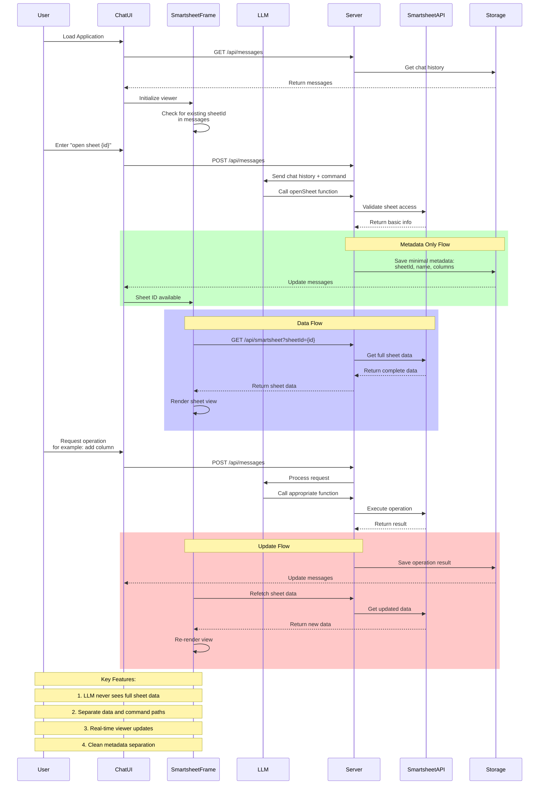
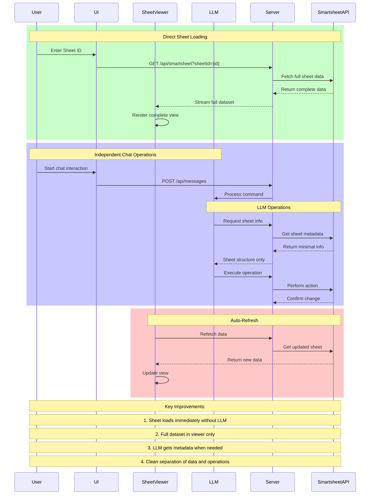
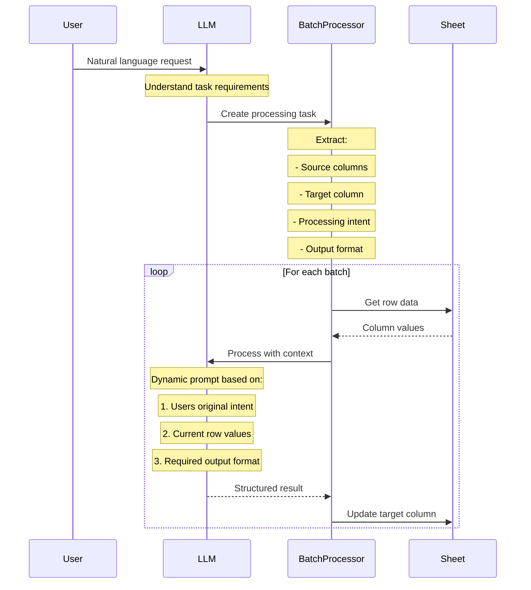
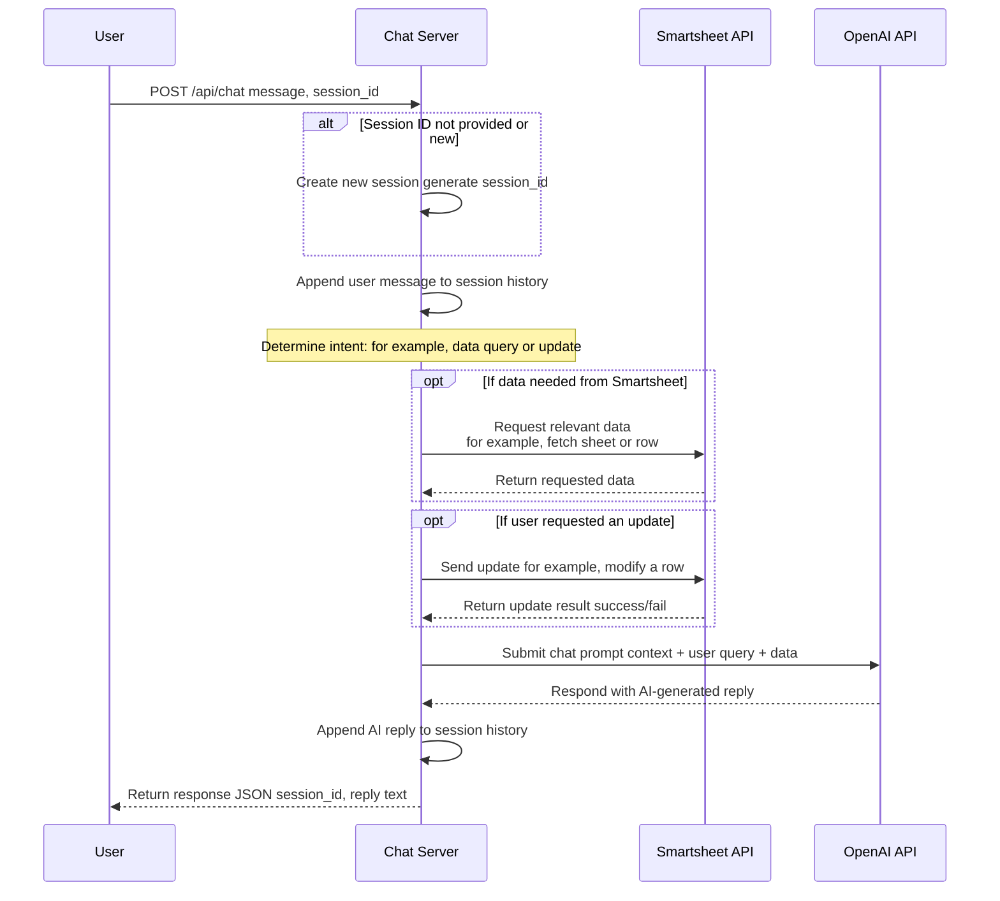
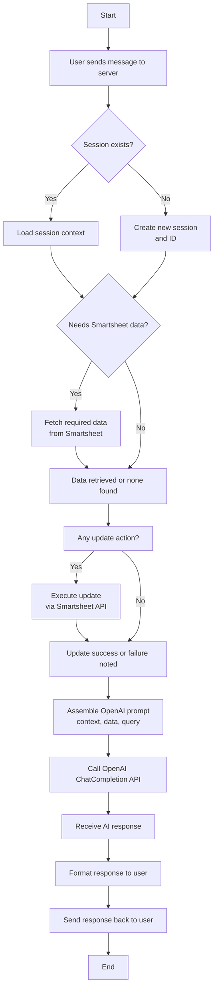
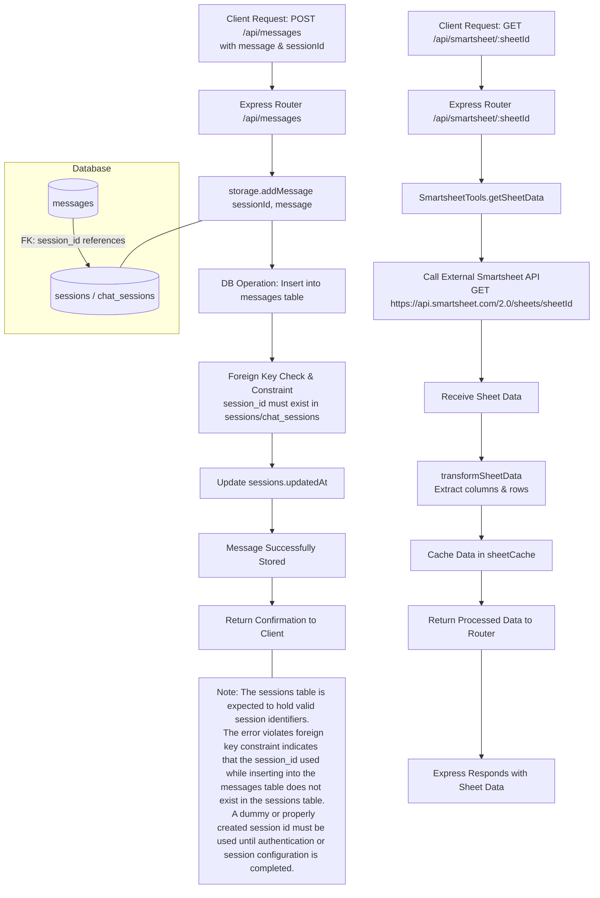

```mermaid
sequenceDiagram
    participant User
    participant ChatLLM
    participant JobQueue
    participant BulkProcessor
    participant ProcessingLLM
    participant Sheet

    %% Initial Task Setup
    User->>ChatLLM: Request column processing
    
    rect rgb(200, 255, 200)
        Note over ChatLLM: Task Understanding Phase
        ChatLLM->>ChatLLM: Analyze request
        ChatLLM->>ChatLLM: Generate processing prompt
        ChatLLM->>JobQueue: Create processing job
        ChatLLM->>User: Confirm job creation
    end

    %% Async Processing
    rect rgb(200, 200, 255)
        JobQueue->>BulkProcessor: Start background job
        
        loop Process Batches
            BulkProcessor->>Sheet: Get batch rows
            Sheet-->>BulkProcessor: Row data
            
            loop Each Row
                BulkProcessor->>ProcessingLLM: Apply generated prompt
                ProcessingLLM-->>BulkProcessor: Process result
            end
            
            BulkProcessor->>Sheet: Update batch
            BulkProcessor->>JobQueue: Update progress
        end
        
        JobQueue->>User: Notify completion
        
```









