# ChatSheetAI System Architecture Design

## 1. System Overview

ChatSheetAI is an integrated application that combines Smartsheet data management with Azure OpenAI's language processing capabilities. The system enables users to interact with Smartsheet data through both a visual interface and natural language conversations.

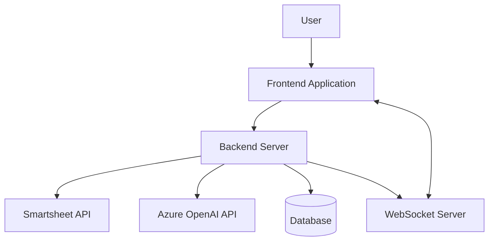

## 2. Architecture Principles

The architecture follows these key principles:

1. **Separation of Concerns**: Clear separation between frontend, backend, and external services
2. **Single Source of Truth**: All data operations flow through a centralized API layer
3. **Real-time Communication**: WebSocket-based updates for immediate feedback
4. **Asynchronous Processing**: Background job processing for long-running operations
5. **Resilient Design**: Comprehensive error handling and recovery mechanisms

## 3. System Components

### 3.1 Frontend Application

The frontend is a React-based single-page application (SPA) that provides the user interface for interacting with Smartsheet data.

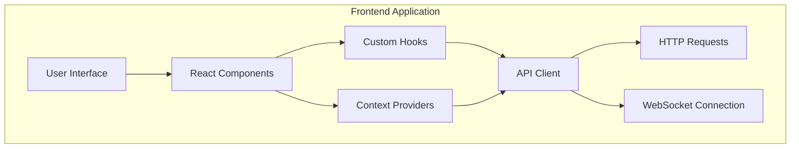

#### Key Components

- **React**: Core UI framework
- **React Query**: Data fetching and caching
- **Context API**: State management
- **Custom Hooks**: Encapsulated business logic
- **WebSocket Client**: Real-time communication

#### Frontend Structure

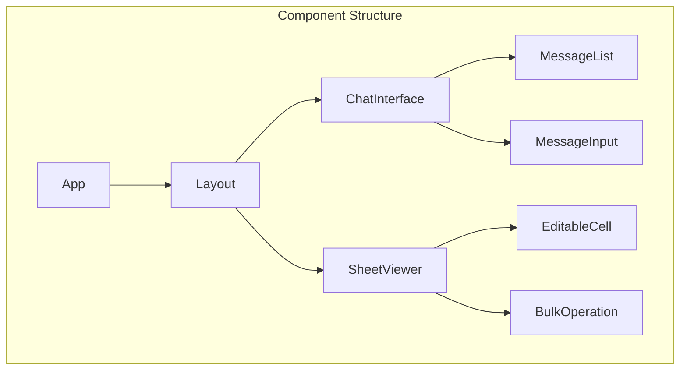

### 3.2 Backend Server

The backend is a Node.js Express server that handles API requests, communicates with external services, and manages data persistence.

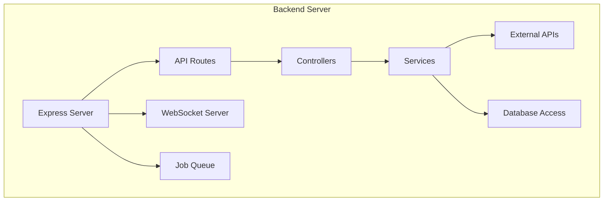

#### Key Components

- **Express**: Web server framework
- **BullMQ**: Job queue for background processing
- **Redis**: Cache and job queue storage
- **WebSocket**: Real-time communication server
- **Database**: Data persistence layer

#### API Routes Structure

```mermaid
graph TD
    subgraph "API Routes"
        API[API Router] --> Messages[/api/messages]
        API --> Sessions[/api/sessions]
        API --> Smartsheet[/api/smartsheet]
        API --> Jobs[/api/jobs]
        API --> Webhooks[/api/webhooks]
    end
```

### 3.3 External Services

The system integrates with several external services to provide its functionality.

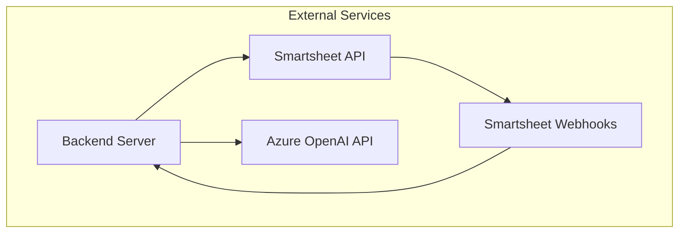

## 4. Data Flow

### 4.1 Request-Response Flow

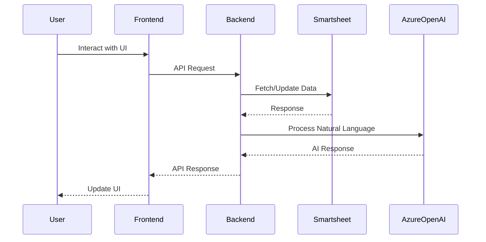

### 4.2 Real-time Update Flow

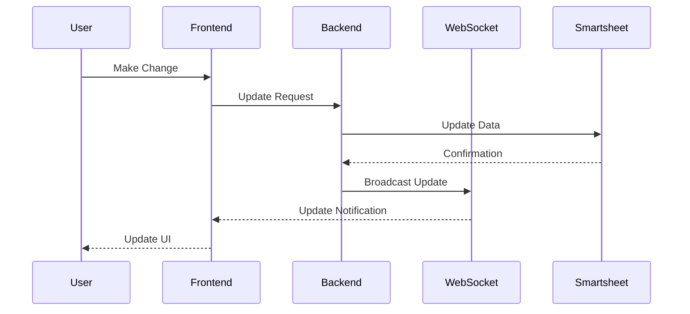

### 4.3 Background Job Flow

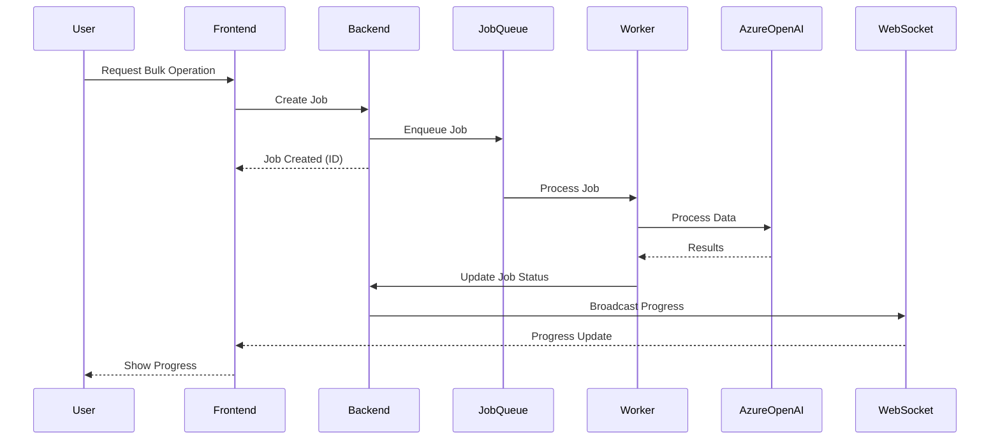

## 5. Technology Stack

### 5.1 Frontend Technologies

| Technology     | Purpose                     |
| -------------- | --------------------------- |
| React          | UI framework                |
| TypeScript     | Type-safe JavaScript        |
| React Query    | Data fetching and caching   |
| TanStack Table | Data grid component         |
| Tailwind CSS   | Utility-first CSS framework |
| shadcn/ui      | UI component library        |
| WebSocket      | Real-time communication     |

### 5.2 Backend Technologies

| Technology        | Purpose                 |
| ----------------- | ----------------------- |
| Node.js           | JavaScript runtime      |
| Express           | Web framework           |
| TypeScript        | Type-safe JavaScript    |
| BullMQ            | Job queue               |
| Redis             | Cache and queue storage |
| SQLite/PostgreSQL | Data persistence        |
| WebSocket         | Real-time communication |
| Zod               | Schema validation       |

### 5.3 External Services

| Service             | Purpose                      | Integration Method |
| ------------------- | ---------------------------- | ------------------ |
| Smartsheet API      | Data source and manipulation | REST API           |
| Smartsheet Webhooks | Real-time sheet updates      | Webhook callbacks  |
| Azure OpenAI API    | Natural language processing  | REST API           |

## 6. Database Schema and Data Dictionary

The application uses PostgreSQL with Drizzle ORM for data persistence. The database schema consists of three primary tables: chat_sessions, messages, and jobs.

### 6.1 Entity Relationship Diagram

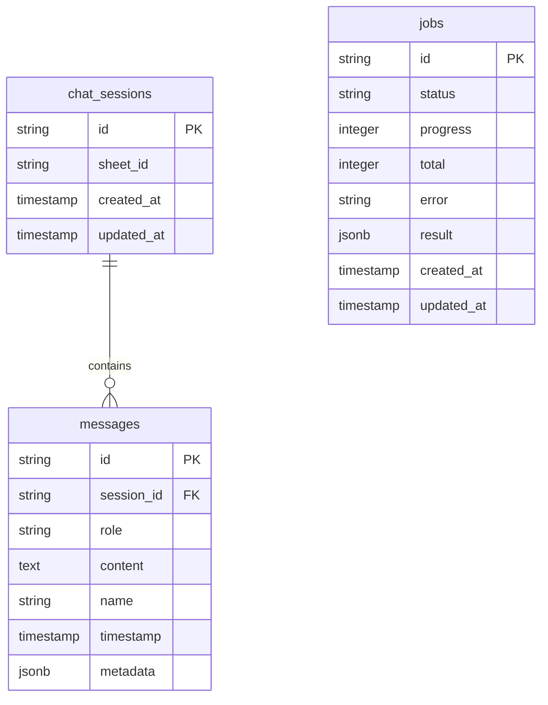

### 6.2 Table Definitions

#### 6.2.1 chat_sessions

Stores information about user chat sessions and their associated Smartsheet.

| Column     | Type      | Constraints             | Description                                       |
| ---------- | --------- | ----------------------- | ------------------------------------------------- |
| id         | text      | PRIMARY KEY             | Unique identifier for the session (UUID)          |
| sheet_id   | text      | NOT NULL                | ID of the Smartsheet associated with this session |
| created_at | timestamp | NOT NULL, DEFAULT now() | When the session was created                      |
| updated_at | timestamp | NOT NULL, DEFAULT now() | When the session was last updated                 |

#### 6.2.2 messages

Stores all messages exchanged in chat sessions.

| Column     | Type      | Constraints   | Description                                                    |
| ---------- | --------- | ------------- | -------------------------------------------------------------- |
| id         | text      | PRIMARY KEY   | Unique identifier for the message (UUID)                       |
| session_id | text      | FOREIGN KEY   | Reference to the chat session this message belongs to          |
| role       | text      | NOT NULL      | Role of the message sender (user, assistant, system, function) |
| content    | text      | NOT NULL      | The actual message content                                     |
| name       | text      | NULL          | Optional name for function calls                               |
| timestamp  | timestamp | DEFAULT now() | When the message was created                                   |
| metadata   | jsonb     | NULL          | Additional metadata about the message                          |

#### 6.2.3 jobs

Stores information about background processing jobs.

| Column     | Type      | Constraints             | Description                                                       |
| ---------- | --------- | ----------------------- | ----------------------------------------------------------------- |
| id         | text      | PRIMARY KEY             | Unique identifier for the job (UUID)                              |
| status     | text      | NOT NULL                | Current status of the job (queued, processing, completed, failed) |
| progress   | integer   | NOT NULL, DEFAULT 0     | Number of items processed                                         |
| total      | integer   | NOT NULL, DEFAULT 0     | Total number of items to process                                  |
| error      | text      | NULL                    | Error message if the job failed                                   |
| result     | jsonb     | NULL                    | Result data from the completed job                                |
| created_at | timestamp | NOT NULL, DEFAULT now() | When the job was created                                          |
| updated_at | timestamp | NOT NULL, DEFAULT now() | When the job was last updated                                     |

### 6.3 Data Types and Structures

#### 6.3.1 Message Types

Messages in the system can have the following roles:

- **user**: Messages sent by the user
- **assistant**: Responses from the AI assistant
- **system**: System messages providing context or information
- **function**: Results from function calls made by the assistant
- **error**: Error messages

#### 6.3.2 Message Metadata

The `metadata` field in the messages table is a JSONB object that can contain:

```typescript
{
  id: string;              // Unique identifier
  type: string;            // Message type (USER, ASSISTANT, SYSTEM, ERROR)
  timestamp: string;       // ISO timestamp
  sessionId?: string;      // Associated session ID
  status?: string;         // Message status (pending, complete, error, success)
  error?: any;             // Error information if applicable
  operation?: string;      // Associated operation name
  name?: string;           // Function name for function calls
}
```

#### 6.3.3 Job Status Values

Jobs can have the following status values:

- **queued**: Job is waiting to be processed
- **processing**: Job is currently being processed
- **completed**: Job has finished successfully
- **failed**: Job encountered an error and could not complete

#### 6.3.4 Job Result Structure

The `result` field in the jobs table is a JSONB object that varies based on job type:

For AI processing jobs:

```typescript
{
  processedRows: number;    // Number of rows processed
  failedRows: number;       // Number of rows that failed processing
  sampleResults: any[];     // Sample of processed results
}
```

For bulk update jobs:

```typescript
{
  rowsAffected: number;     // Number of rows updated
  rowIds: string[];         // IDs of affected rows
}
```

### 6.4 Database Indexes and Constraints

- Foreign key constraint between `messages.session_id` and `chat_sessions.id` with cascade delete
- Indexes on frequently queried columns:
  - `messages.session_id` for efficient message retrieval by session
  - `jobs.status` for efficient job status filtering

### 6.5 Data Flow and Persistence

1. When a user starts a new chat, a new record is created in the `chat_sessions` table
2. Each message exchanged is stored in the `messages` table with a reference to its session
3. Long-running operations create entries in the `jobs` table for tracking progress
4. Session data is persisted across user sessions, allowing conversation history to be maintained

## 7. API Endpoints

### 7.1 Session Management

| Endpoint            | Method | Description          |
| ------------------- | ------ | -------------------- |
| `/api/sessions`     | GET    | List all sessions    |
| `/api/sessions`     | POST   | Create a new session |
| `/api/sessions/:id` | GET    | Get session details  |
| `/api/sessions/:id` | DELETE | Delete a session     |

### 7.2 Message Handling

| Endpoint        | Method | Description                  |
| --------------- | ------ | ---------------------------- |
| `/api/messages` | GET    | Get messages for a session   |
| `/api/messages` | POST   | Send a new message           |
| `/api/messages` | DELETE | Clear messages for a session |

### 7.3 Smartsheet Operations

| Endpoint                                     | Method | Description           |
| -------------------------------------------- | ------ | --------------------- |
| `/api/smartsheet/:sheetId`                   | GET    | Get sheet information |
| `/api/smartsheet/:sheetId/columns`           | GET    | Get sheet columns     |
| `/api/smartsheet/:sheetId/columns`           | POST   | Add a new column      |
| `/api/smartsheet/:sheetId/columns/:columnId` | PATCH  | Update a column       |
| `/api/smartsheet/:sheetId/columns/:columnId` | DELETE | Delete a column       |
| `/api/smartsheet/:sheetId/rows`              | GET    | Get sheet rows        |
| `/api/smartsheet/:sheetId/rows`              | POST   | Add a new row         |
| `/api/smartsheet/:sheetId/rows/:rowId`       | GET    | Get a specific row    |
| `/api/smartsheet/:sheetId/rows/:rowId`       | PATCH  | Update a row          |
| `/api/smartsheet/:sheetId/rows/:rowId`       | DELETE | Delete a row          |

### 7.4 Job Management

| Endpoint           | Method | Description      |
| ------------------ | ------ | ---------------- |
| `/api/jobs`        | POST   | Create a new job |
| `/api/jobs/:jobId` | GET    | Get job status   |
| `/api/jobs/:jobId` | DELETE | Cancel a job     |

### 7.5 Webhook Handling

| Endpoint                   | Method | Description                       |
| -------------------------- | ------ | --------------------------------- |
| `/api/webhooks/smartsheet` | POST   | Receive Smartsheet webhook events |

## 8. Authentication and Security

### 8.1 Authentication Flow

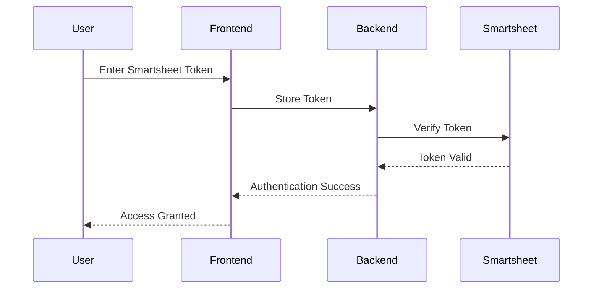

### 8.2 Security Measures

- **API Token Storage**: Secure storage of Smartsheet API tokens
- **HTTPS**: Encrypted communication between client and server
- **Input Validation**: Comprehensive validation of all user inputs
- **Rate Limiting**: Protection against excessive API usage
- **Error Handling**: Secure error handling that doesn't expose sensitive information

## 9. WebSocket Communication

The WebSocket server enables real-time updates and notifications.

### 9.1 WebSocket Events

| Event          | Direction       | Description                                      |
| -------------- | --------------- | ------------------------------------------------ |
| `connect`      | Client → Server | Establish connection                             |
| `subscribe`    | Client → Server | Subscribe to updates for a specific sheet or job |
| `unsubscribe`  | Client → Server | Unsubscribe from updates                         |
| `sheet_update` | Server → Client | Notification of sheet changes                    |
| `job_status`   | Server → Client | Job progress updates                             |
| `error`        | Server → Client | Error notifications                              |

### 9.2 WebSocket Architecture

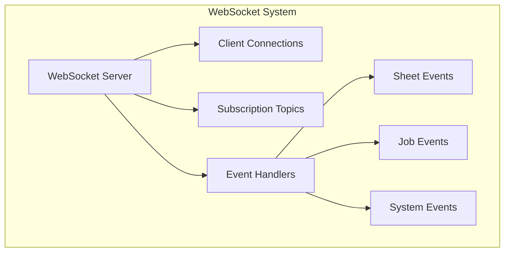

## 10. Job Processing System

The job processing system handles long-running operations asynchronously.

### 10.1 Job Queue Architecture

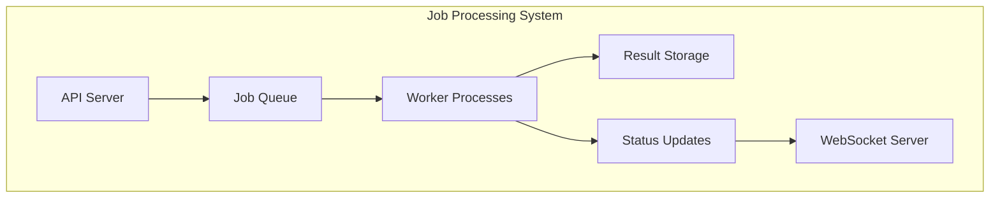

### 10.2 Job Types

| Job Type          | Description             | Parameters                      |
| ----------------- | ----------------------- | ------------------------------- |
| `SUMMARIZE`       | Generate text summaries | `sourceColumns`, `targetColumn` |
| `SCORE_ALIGNMENT` | Score BCH alignment     | `sourceColumns`, `targetColumn` |
| `EXTRACT_TERMS`   | Extract key terms       | `sourceColumns`, `targetColumn` |
| `BULK_UPDATE`     | Update multiple rows    | `criteria`, `updates`           |

### 10.3 Job Lifecycle

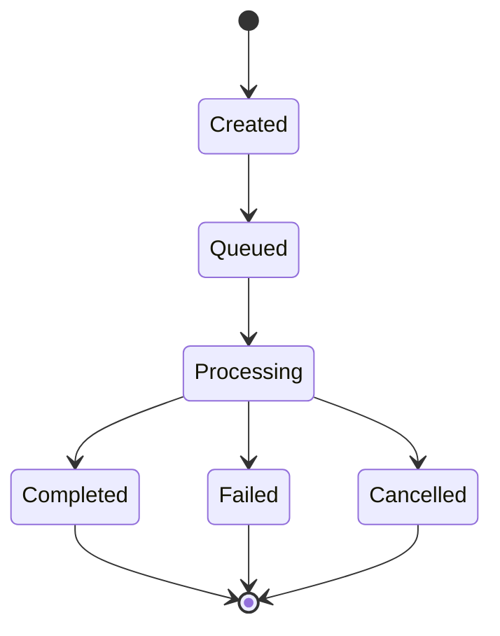

## 11. Error Handling and Resilience

### 11.1 Error Handling Strategy

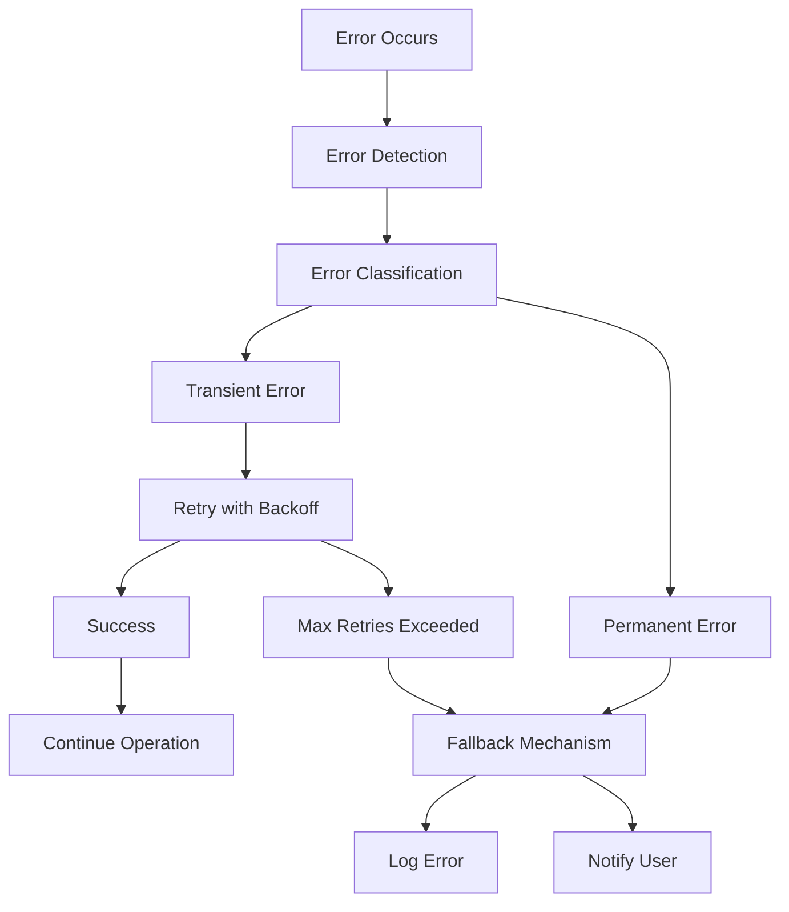

### 11.2 Retry Mechanism

The system implements an exponential backoff retry mechanism for transient failures:

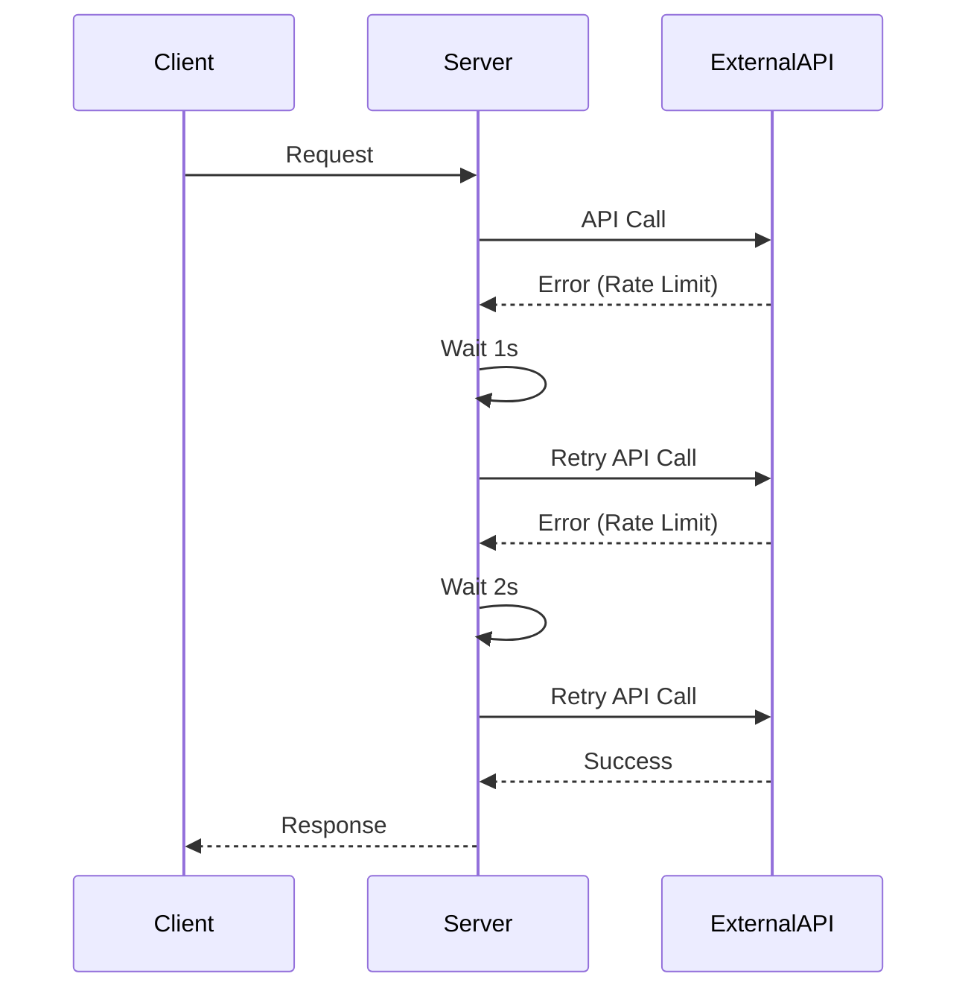

### 11.3 Circuit Breaker Pattern

The system implements the circuit breaker pattern to prevent cascading failures:

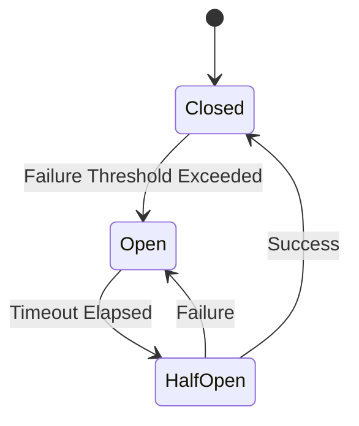

## 12. Deployment Architecture

### 12.1 Development Environment

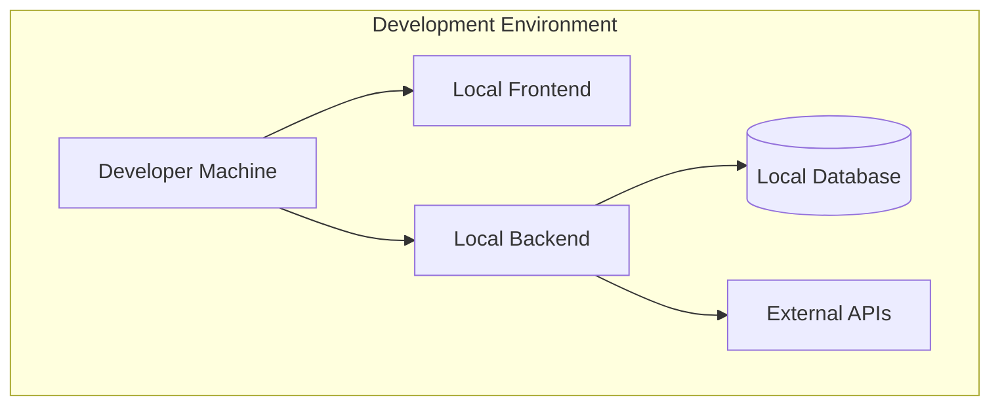

### 12.2 Production Environment

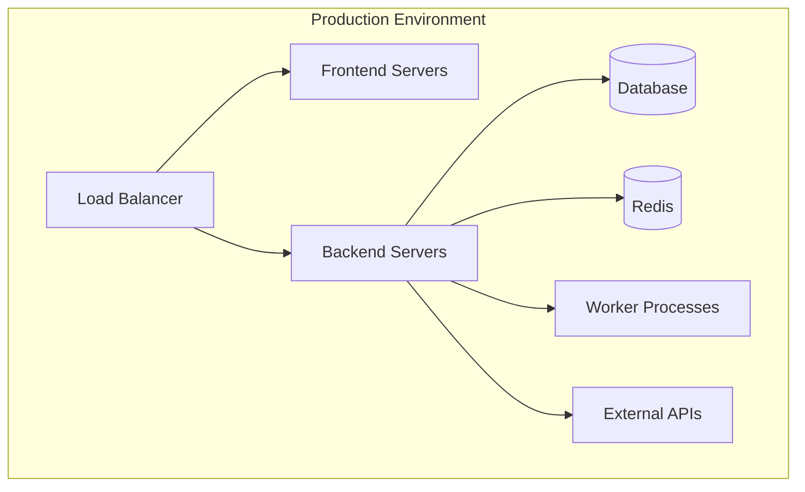

## 13. Performance Considerations

### 13.1 Caching Strategy

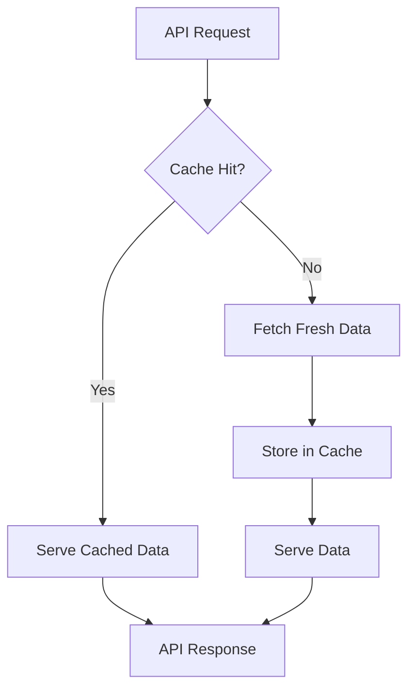

### 13.2 Performance Optimization Techniques

- **Request Batching**: Combining multiple requests into a single API call
- **Incremental Loading**: Loading data in chunks as needed
- **Caching**: Storing frequently accessed data in memory
- **Optimistic Updates**: Updating UI before server confirmation
- **Lazy Loading**: Loading components and data only when needed
- **WebSocket Efficiency**: Using binary protocols for data transfer

## 14. Monitoring and Logging

### 14.1 Logging Architecture

```mermaid
graph TD
    App[Application] --> Logger[Logger]
    Logger --> Console[Console Logs]
    Logger --> FileSystem[File System]
    Logger --> ErrorTracking[Error Tracking]
```

### 14.2 Monitoring Metrics

| Metric                | Description                                | Alert Threshold |
| --------------------- | ------------------------------------------ | --------------- |
| API Response Time     | Time to complete API requests              | > 1000ms        |
| Error Rate            | Percentage of requests resulting in errors | > 1%            |
| Job Queue Length      | Number of jobs waiting to be processed     | > 100           |
| Job Processing Time   | Time to complete background jobs           | > 30s           |
| WebSocket Connections | Number of active WebSocket connections     | N/A             |
| Memory Usage          | Server memory consumption                  | > 80%           |
| CPU Usage             | Server CPU utilization                     | > 70%           |

## 15. Third-Party Integration Details

### 15.1 Smartsheet API Integration

#### Authentication

- **Method**: API Token
- **Storage**: Secure server-side storage
- **Renewal**: Manual token refresh

#### API Endpoints Used

| Endpoint                                      | Purpose                |
| --------------------------------------------- | ---------------------- |
| `GET /sheets/{sheetId}`                       | Retrieve sheet data    |
| `GET /sheets/{sheetId}/columns`               | Get column information |
| `POST /sheets/{sheetId}/columns`              | Add a new column       |
| `PUT /sheets/{sheetId}/columns/{columnId}`    | Update a column        |
| `DELETE /sheets/{sheetId}/columns/{columnId}` | Delete a column        |
| `GET /sheets/{sheetId}/rows/{rowId}`          | Get row data           |
| `POST /sheets/{sheetId}/rows`                 | Add a new row          |
| `PUT /sheets/{sheetId}/rows/{rowId}`          | Update a row           |
| `DELETE /sheets/{sheetId}/rows/{rowId}`       | Delete a row           |

#### Webhook Integration

- **Events**: `*.*` (all events)
- **Callback URL**: `/api/webhooks/smartsheet`
- **Version**: 2.0
- **Scope**: Sheet-level

### 15.2 Azure OpenAI API Integration

#### Authentication

- **Method**: API Key
- **Storage**: Secure server-side storage
- **Endpoint**: Azure-specific endpoint

#### API Endpoints Used

| Endpoint                                               | Purpose          |
| ------------------------------------------------------ | ---------------- |
| `/openai/deployments/{deployment-id}/chat/completions` | Chat completions |
| `/openai/deployments/{deployment-id}/completions`      | Text completions |

#### Model Configuration

| Parameter           | Value                  |
| ------------------- | ---------------------- |
| `model`             | `gpt-4` or `gpt-4-32k` |
| `temperature`       | 0.7                    |
| `max_tokens`        | 4000                   |
| `top_p`             | 1                      |
| `frequency_penalty` | 0                      |
| `presence_penalty`  | 0                      |

## 16. Environment Configuration

The application uses environment variables for configuration, following the 12-factor app methodology. This approach provides flexibility, security, and ease of deployment across different environments.

### 16.1 Environment Variables

#### 16.1.1 Server Environment Variables

| Variable                    | Purpose                     | Required | Default            | Description                                        |
| --------------------------- | --------------------------- | -------- | ------------------ | -------------------------------------------------- |
| `DATABASE_URL`              | Database connection         | Yes      | -                  | PostgreSQL connection string for the main database |
| `TEST_DATABASE_URL`         | Test database connection    | No       | -                  | PostgreSQL connection string for the test database |
| `AZURE_OPENAI_API_BASE`     | Azure OpenAI endpoint       | Yes      | -                  | Base URL for Azure OpenAI API                      |
| `AZURE_OPENAI_API_KEY`      | Azure OpenAI authentication | Yes      | -                  | API key for Azure OpenAI service                   |
| `AZURE_OPENAI_API_VERSION`  | Azure OpenAI version        | Yes      | 2025-01-01-preview | API version for Azure OpenAI                       |
| `AZURE_OPENAI_DEPLOYMENT`   | Azure OpenAI deployment     | Yes      | -                  | Deployment name for Azure OpenAI model             |
| `AZURE_OPENAI_MODEL`        | Azure OpenAI model          | Yes      | -                  | Model name for Azure OpenAI                        |
| `SMARTSHEET_ACCESS_TOKEN`   | Smartsheet authentication   | Yes      | -                  | API token for Smartsheet access                    |
| `SMARTSHEET_WEBHOOK_SECRET` | Smartsheet webhook security | No       | -                  | Secret for validating Smartsheet webhook calls     |

#### 16.1.2 Client Environment Variables

| Variable       | Purpose      | Required | Default               | Description             |
| -------------- | ------------ | -------- | --------------------- | ----------------------- |
| `VITE_API_URL` | API endpoint | Yes      | http://localhost:3000 | URL for the backend API |

### 16.2 Configuration Management

The application follows these principles for configuration management:

1. **Environment Separation**: Different configurations for development, testing, and production environments
2. **Secret Management**: Sensitive information is never committed to version control
3. **Default Values**: Non-sensitive configuration has sensible defaults where appropriate
4. **Validation**: Environment variables are validated at startup to ensure required values are present

### 16.3 Benefits of This Approach

1. **Security**: Sensitive credentials are kept out of the codebase
2. **Flexibility**: Easy to configure for different environments without code changes
3. **Scalability**: Supports deployment across multiple environments with different configurations
4. **Maintainability**: Centralizes configuration management
5. **Compliance**: Follows industry best practices for secret management

### 16.4 Implementation Details

#### Environment Variable Loading

The server uses dotenv to load environment variables from a .env file:

```typescript
import dotenv from "dotenv";
import path from "path";
dotenv.config({ path: path.join(process.cwd(), "server", ".env") });
```

#### Configuration Validation

The application validates required environment variables at startup:

```typescript
if (!process.env.DATABASE_URL) {
  throw new Error("DATABASE_URL environment variable is required");
}
```

#### Environment-specific Behavior

The application can adapt its behavior based on the environment:

```typescript
const isDevelopment = process.env.NODE_ENV === "development";
const isProduction = process.env.NODE_ENV === "production";
```

## 17. Development Workflow

```mermaid
graph LR
    subgraph "Development Workflow"
        Req[Requirements] --> Design[Design]
        Design --> Implement[Implementation]
        Implement --> Test[Testing]
        Test --> Review[Code Review]
        Review --> Deploy[Deployment]
        Deploy --> Monitor[Monitoring]
        Monitor --> Feedback[Feedback]
        Feedback --> Req
    end
```

## 18. Conclusion

This system architecture document outlines the technical design for the ChatSheetAI application, focusing on the ideal state for the first release. The architecture provides a robust foundation for integrating Smartsheet data with Azure OpenAI's language processing capabilities, enabling users to interact with their data through both visual and conversational interfaces.

The design emphasizes:

1. **Modularity**: Clear separation of concerns for maintainability
2. **Scalability**: Asynchronous processing for handling large workloads
3. **Resilience**: Comprehensive error handling and recovery mechanisms
4. **Real-time Updates**: WebSocket-based communication for immediate feedback
5. **Security**: Proper authentication and data protection measures
6. **Configuration**: Environment-based configuration for flexibility and security

This architecture supports the functional requirements outlined in the functional specification while providing a technical foundation that can be extended in future releases.
